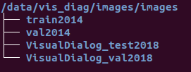
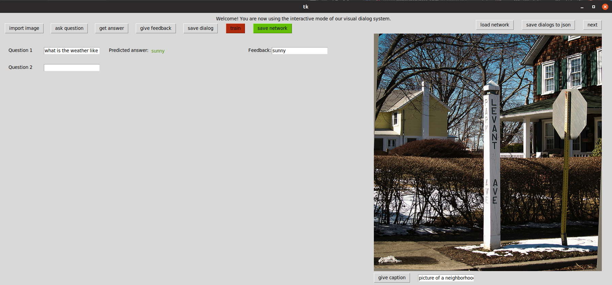

# VisDiag
This is the code I used in my 2nd M.Sc. research project.	We tried in this work to introduce an interactive training mode that allows us to integrate the human-in-the-loop concept into the visual dialog task. This interactive mode lets humans evaluate a pre-trained agent and give it feedback that can be used for online training purposes. In addition, we investigate the possibility of improving the quality of learning using only limited amounts of data. Results and deatiled information about the overall structure of the project can be found in the [report](https://github.com/adnenabdessaied/VisDiag/blob/master/report.pdf) included in this repository.

### Pre-training
To pre-train the network, we use the VisDial dataset v0.9 of the visual dialog challenge that can be downloaded from [here](https://visualdialog.org/data) alongside with the 2014 COCO datasets. The latter can be found [here](http://cocodataset.org/#download). 
After downloading the data from the two links mentioned above, the images should be save in a directory that we will call  from now on `$IMAGES`. Its structure should look like this:
<p align="center"></p>

Now clone/download our repo to a path that we call `$REPO` and install all the requirements by executing the following in a terminal: 
```bash
cd $REPO
pip install -r requirements.txt
```
It is always wise to install them in a virtual environment to avoid any potential compatibility issues that may arise in the future.
Now generate the word to index and the index to word mappings and save them into disk.
```bash
cd preprocessing
python vocabulary_reader.py --path_training /path/to/visdial_0.9_train.json --path_val /path/to/visdial_0.9_val.json --images_dir $IMAGES
```
By default, they will be saved directly into `$REPO`.
Now go ahead and start training the network by executing
```bash
cd ..
python train.py --path_training /path/to/visdial_0.9_train.json --path_val /path/to/visdial_0.9_val.json --images_dir $IMAGES
```
Our pre-trained generative decoders (using Late fusion and Memory network encoding) can be found [here](https://drive.google.com/open?id=1ED-GwQpeANKOtQFsatSmxMHy3fuQwq-V).
#### Checkpointing
``train.py`` will save network checkpoints of the last 10 epochs in ``$REPO/checkpoints``. The best checkpoint will be saved in ``$REPO/checkpoints/best``. By best checkpoint we mean the one that scores the smallest validation loss. 

#### Logging
We used [TensorboardX](https://github.com/lanpa/tensorboardX) to log the training and validation progress. To take advantage of that, execute  
```bash
tensorboard --logdir=summaries
```
and then visit ``localhost:6006`` in your browser.

### Interactive mode
The interactive mode allows us to assess a pre-trained network, generate new data and progressively fine tune the model to achieve better performances. This mode take the form of a GUI, imeplemented with [tkinter](https://docs.python.org/3/library/tkinter.html). 
To be able to use it, make sure that you have tkinter installed on your computer then execute: 
```bash
cd GUI
python gui.py
```
The output of the interface, e.g. the fine tuned network or the logged dialogs, will be saved by default in ``$REPO/output_interactive``.
This is what you should get if everything was done correctly:
<p align="center"></p>

In the  [report](https://github.com/adnenabdessaied/VisDiag/blob/master/report.pdf), we gave an extenive walkthrough on how this interface is used.

### Acknoledgments
We thank the team of [the visual dialog challenge](https://visualdialog.org/people) for their [pytorch implementation](https://github.com/batra-mlp-lab/visdial-challenge-starter-pytorch) that greatly influenced this work.
